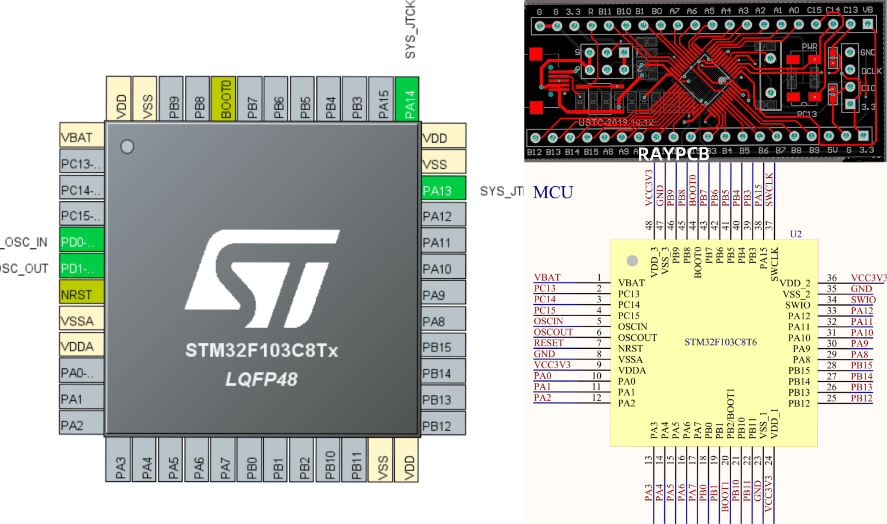
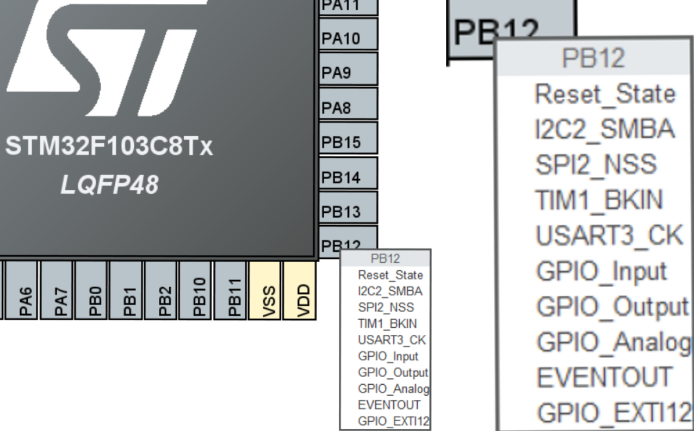

# How to Read Schematics and PCBs?

[Back to home](../README.md) | [Next chapter](./1-Advanced_GPIO.md)

## Software ⇔ Hardware

<table width="1050" style="border: none; margin-top: 10px; margin-left: 0;">
  <tr style="border: none; background: none;">
    <td width="50%" align="center" style="border: none; padding: 0 10px 0 0;">
      <strong>LEFT:</strong> .ioc file in stm32CubeMX
    </td>
    <td width="50%" align="center" style="border: none; padding: 0 10px 0 0;">
      <strong>RIGHT:</strong> PCB layout (top) & schematic (bottom)
    </td>
  </tr>
</table>

### Core Concepts
* **Schematic**: Mindmap of the MCU pins (Hardware team).
* **PCB**: Physical layout routing tracks from the MCU (Hardware team).
* **.ioc File**: Configuration blueprint mapping pin functions (Software team).

### Workflow & Configuration
* **The Goal**: Software configures the `.ioc` first so hardware can draw the schematic/PCB.
* **Default Pins**: Every pin has multiple default internal functions set by STMicroelectronics.
* **How to Change**: Open STM32CubeMX, click a pin, and select its function.

## Common Interfaces

<table width="1050">
  <thead>
    <tr>
      <th align="left" width="20%">Interface</th>
      <th align="left" width="80%">Configure the pins in `.ioc` to</th>
    </tr>
  </thead>
  <tbody>
    <tr>
      <td><strong>GPIO</strong></td>
      <td>GPIO_Input, GPIO_Output</td>
    </tr>
    <tr>
      <td><strong>ADC</strong></td>
      <td>ADCx_INx</td>
    </tr>
    <tr>
      <td><strong>PWM</strong></td>
      <td>TIMx_CHx</td>
    </tr>
    <tr>
      <td><strong>UART</strong></td>
      <td>USARTx_TX, USARTx_RX</td>
    </tr>
    <tr>
      <td><strong>I2C</strong></td>
      <td>I2Cx_SDA, I2Cx_SCL</td>
    </tr>
    <tr>
      <td><strong>SPI</strong></td>
      <td>SPIx_SCK, SPIx_MOSI, SPIx_MISO, GPIO for CS</td>
    </tr>
    <tr>
      <td><strong>CAN</strong></td>
      <td>CANx_TX, CANx_RX</td>
    </tr>
  </tbody>
</table>
