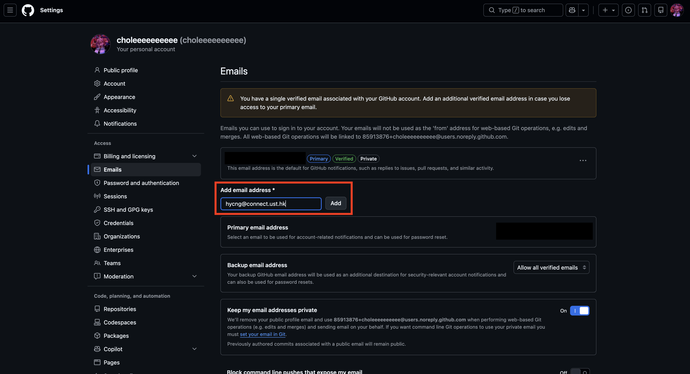
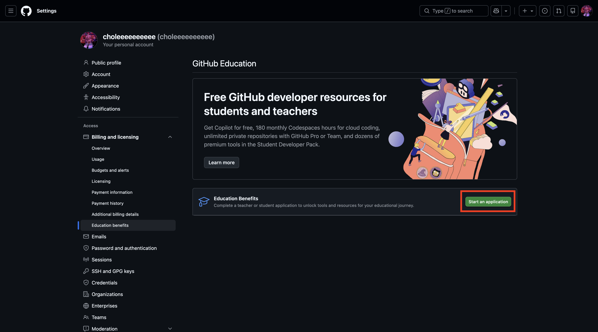

# Setting up Github and Github Student Developer Pack

Authors

Ng Hau Yi Chloe (hycng@connect.ust.hk)

### Prerequisites

We will be using Git for version control and Github for collaboration.

If you do not have Git installed, you can download it here: [Git Website](https://git-scm.com/)

If you do not have a Github Account, you can register for an account here: [Github Website](https://github.com/)

For further readings on how Git and Github works, you may visit the following pages:
* [Git Basics](/advanced-notes/git-basics.md)
* [More Git](/advanced-notes/git-gud.md)

## What is the Github Student Developer Pack?
[GitHub Student Developer Pack](https://education.github.com/pack)

The GitHub Student Developer Pack is a free collection of professional software, cloud services, and learning tools given to verified students. 

You will then have access to Github Copilot Student and other software tools that would make coding more efficient.

## How to Sign Up
1. Go to your account settings on Github (profile pic > settings > Emails) and add your ITSC account (i.e. `xx@connect.ust.hk`) 

2. Go to [GitHub Student Developer Pack](https://education.github.com/pack) and press the `Sign Up for Student Developer Pack` button. 
3. You should be redirected to your Github account settings page. Click on the `Start an application` button to start an application for Education Benefits.

4. Select your role as a Student, select The Hong Kong University of Science and Technology as your school and select your ITSC account as your school email.
5. Follow the instructions for verification.
6. Your application for the developer pack will be verified within 3 days and will be notified through email.

