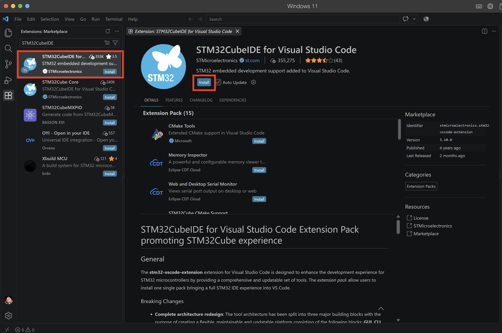

# Setting up STM32CubeIDE for Visual Studio Code

Authors

Ng Hau Yi Chloe (hycng@connect.ust.hk)

## What is STM32CubeIDE

STM32CubeIDE is a free, Eclipse-based integrated development environment from STMicroelectronics for developing applications with STM32 microcontrollers. It combines project configuration, C/C++ code editing, compiling, debugging, and device programming in one tool, and integrates with STM32CubeMX to help configure peripherals and generate initialization code.

The extension pack allows users to do all of the above on Visual Studio Code

[Website of the extension](https://marketplace.visualstudio.com/items?itemName=stmicroelectronics.stm32-vscode-extension)

## Installation steps
1. Go to the Extension Tab (icon with 4 squares on the left) on Visual Studio Code and search for `STM32CubeIDE`. Select the first one and press the install button.

2. Download the project file provided by us: `TODO: Put zip link here` 
3. Extract the zip file to a local folder in your computer (Note: Do not unzip the folder in your oneDrive folder as it disrupts the path names)

## Setting Up the Project
4. Open the project folder in Visual Studio Code
5. Select `Release` for configure preset
6. Click on butterfly STM32 logo, the extension should detect the CMake file in the project folder

## Flashing Code (Test during the first tutorial)
7. Connect the STM32 Board to your computer
8. Go to the Run and Debug Tab (icon with a play button and a bug) 

