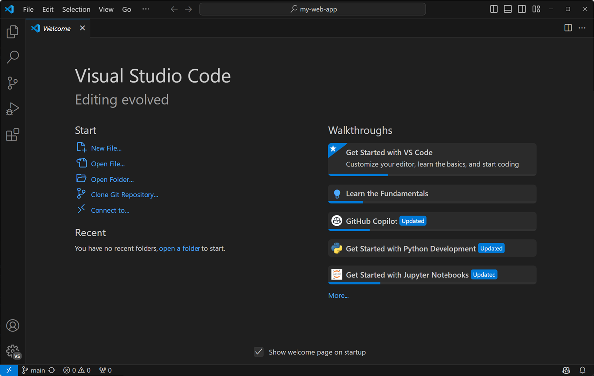

# Installing VS Code

Authors

Ng Hau Yi Chloe (hycng@connect.ust.hk)

Visual Studio Code (VS Code) is a free code editor that supports virtually every major programming language. It has built-in debugging, thousands of customizable extensions, and agentic tools for coding.

We will use VS Code as the platform to write code for robotics project and here is the guide to walk you through the installation.

## Installation link
Download and launch the program from the link below:

[Visual Studio Code Website](https://code.visualstudio.com/)

Proceed with the default installation configurations and login with your Github credentials. If you do not have a Github account yet, you may follow the steps in xx to register for an account.

After configurations, you should be on the Welcoming page of VS Code, as the following:

You may proceed to setting up the STM32 Extension required for the upcoming tutorial.