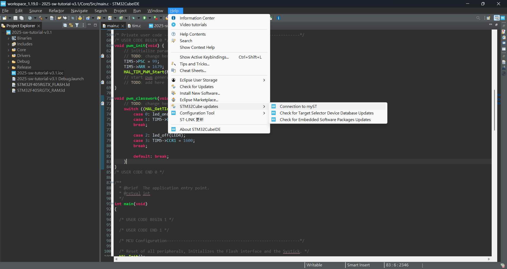
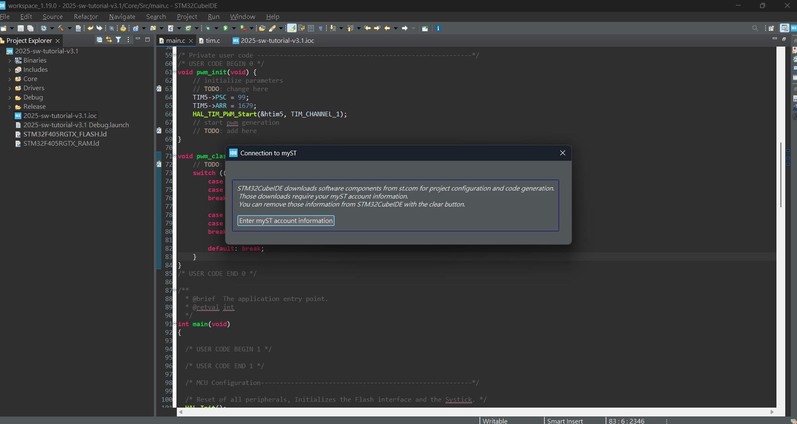
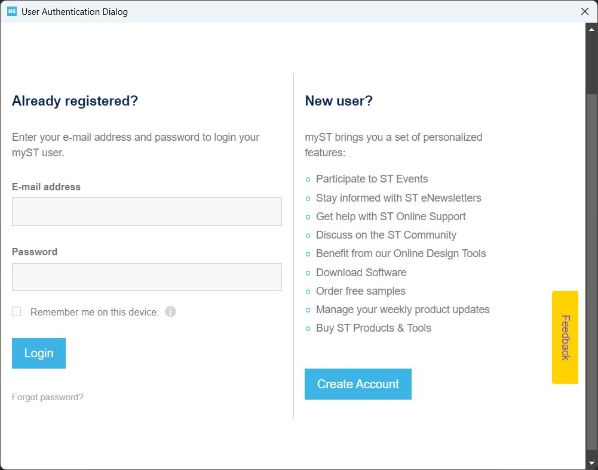
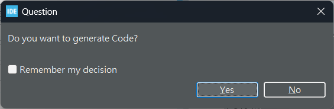

# STM32CubeIDE Log in
To log in to the IDE you need to first create an account (or do so in the following).

1. In the IDE, go to `HELP > STM32CUBE Updates > Connection to myST`

2. Click `Enter myST account information`

3. If you have an account, simply log in, else follow the instructions in the page/website to create your account.

4. Test: try to modify your .ioc and change it back, save the .ioc(DONT CHANGE THE THINGS WE CONFIGURED OR WE WILL GIVE YOU EXTRA HOMEWORK).\
This should generate a window and you should click yes to generate code

>1 way to check is to add code/comments out of USER CODE START-END areas.
If code generation is successful, any code outside the areas should dissapear.
