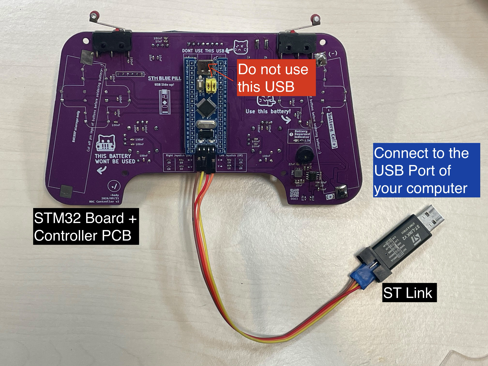
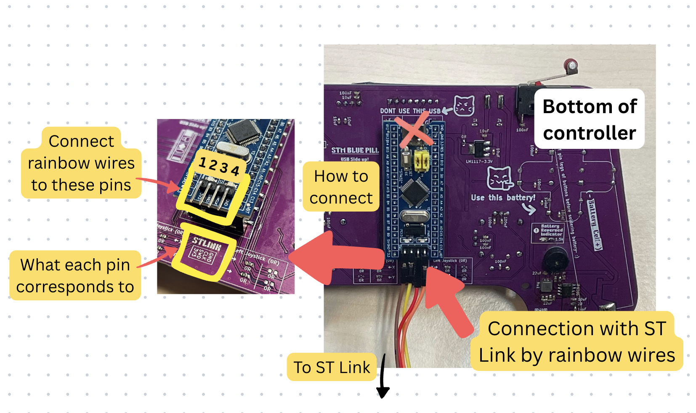
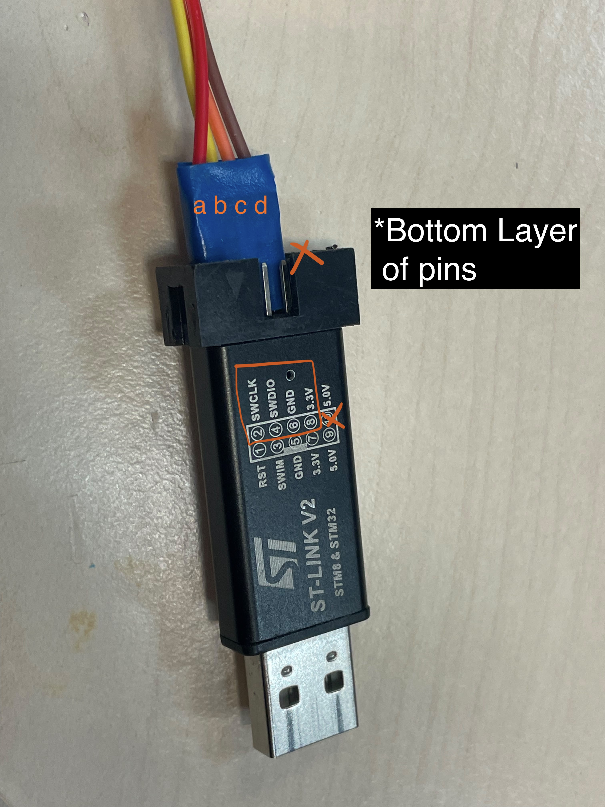

# Flashing Code

Authors

Ng Hau Yi Chloe (hycng@connect.ust.hk)

## System Overview
Below shows the whole system:

**Note:** 
- Bring a USB C to USB A adpater if needed (i.e. If you laptop does not have USB A ports)

## Connection with ST-Link
Here is the specific wiring between the STM32 Board the ST Link:

| Name   | Number on ST Link | Letter on Board |
|--------|-------------------|-----------------|
| 3V3    | 1                 | d               |
| SWDIO  | 2                 | b               |
| SWCLK  | 3                 | a               |
| GND    | 4                 | c               |

Just connect the words together, i.e. `GND <=> GND, SWD <=> SWDIO, CLK <=> SWCLK, 3V3 <=> 3V3`

### The controller's side:

**Note:**
- Do not use the USB port (The PCB also warns you not to use it)

### The ST Link's side:

**Note:**
-  Remember to connect to 3.3V, **DO NOT connect to 5.0V**
- The rainbow wires are connected to the bottom row of the ST Link (bottom relative to the side of the logo and text)

## Flashing Code into the board
1. Connect the ST-Link to your computer's USB Port
2. Open VS Code and open the STM32 project folder
3. Select `Release` as the configure preset if you haven't
4. Press the icon with a bug & play button (Run and Debug)
5. Press `Run and Debug`