# Detailed Scrabble Gameplay Summary

> A more detailed summary on the rules of Scrabble for reference, including all of the most important rules.  
> This will be held as the basis of how our terminal Scrabble works.

Scrabble is a 2 player board game, where both players take turn scoring points on a board, through creating words. In the end, the person with the most points win.  

## Gameplay Objects

### 1. The game board

A 15x15 board, with rows 1-15 and columns A-O. Different tile modifiers exist that increase the scoring of tiles. These include the light blue `Double Letter`, the dark blue `Triple Letter`, the yellow (or sometimes green) `Double Word`, and the red `Triple Word`. They will be further explained in the Scoring part.  
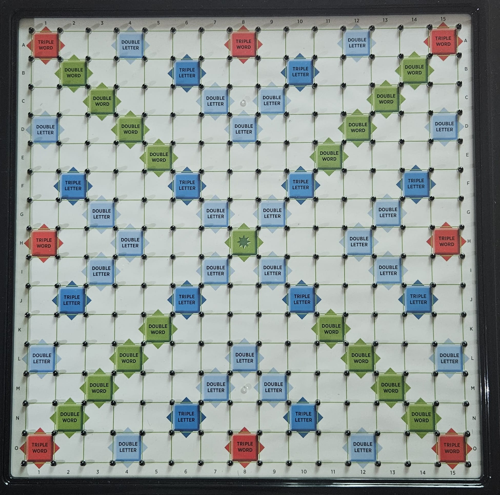

### 2. Tiles

There are 100 tiles, each marked with a different score. The tiles are:

- 1 point: E ×12, A ×9, I ×9, O ×8, N ×6, R ×6, T ×6, L ×4, S ×4, U ×4
- 2 points: D ×4, G ×3
- 3 points: B ×2, C ×2, M ×2, P ×2
- 4 points: F ×2, H ×2, V ×2, W ×2, Y ×2
- 5 points: K ×1
- 8 points: J ×1, X ×1
- 10 points: Q ×1, Z ×1
- 0 points: 2 wildcards (can replace any letter)  

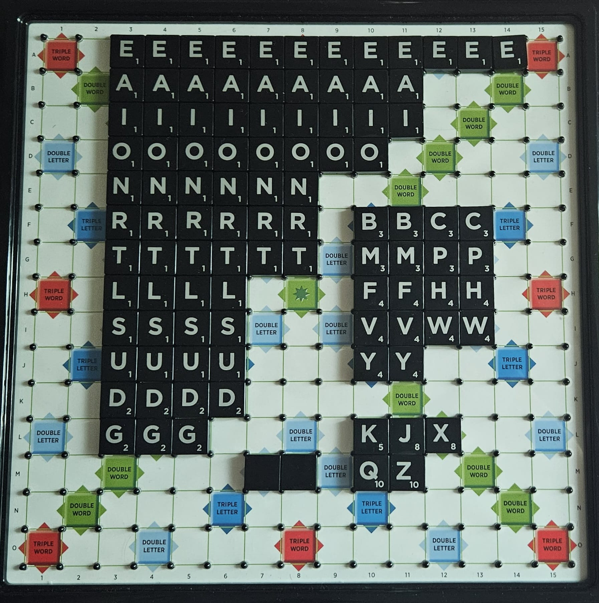

## Game Startup

The game starts with 100 tiles in a "bag" (irl, a physical bag, but in our implementation, a `struct` with a character array holding all of the tiles.)

The 2 players (named P1 and P2), will each take 7 tiles from the bag, and place them on their rack. The letters on a player's rack will be hidden from their opponent.  

Then, (without loss of generality,) P1 can start the game off with their turn.

> I will use an external online tool to help visualise the different rules in Scrabble that may help your implementation.  
> Please note that our implementation will not be as visually appleasing as from the examples provided :\(

## Player Moves

There are 3 main actions a player can do on their turn.  

1. Play a valid word on the board. (PLAY)
2. Exchange tiles from their rack. (EXCH)
3. Pass their turn. (PASS)

A player may **only perform 1** of these options during their turn.

### PLAY

A played word is considered valid, as long as it is within the list of words (in our task, we will be using the CSW24 word list, which is a list of all the words in the Collins English Dictionary).  

A person can only play 1 word (excluding overlaps) per move. And for the first word placed on the board, one of the letters (tiles) must be placed on `H8` (The centre of the board).  

#### First move example

Let's say you have the rack here as P1, first move.  

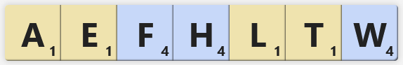

A valid first move would be `WEALTH` starting on D8, played horizontally (which has `T` on H8, making it a valid starting move).

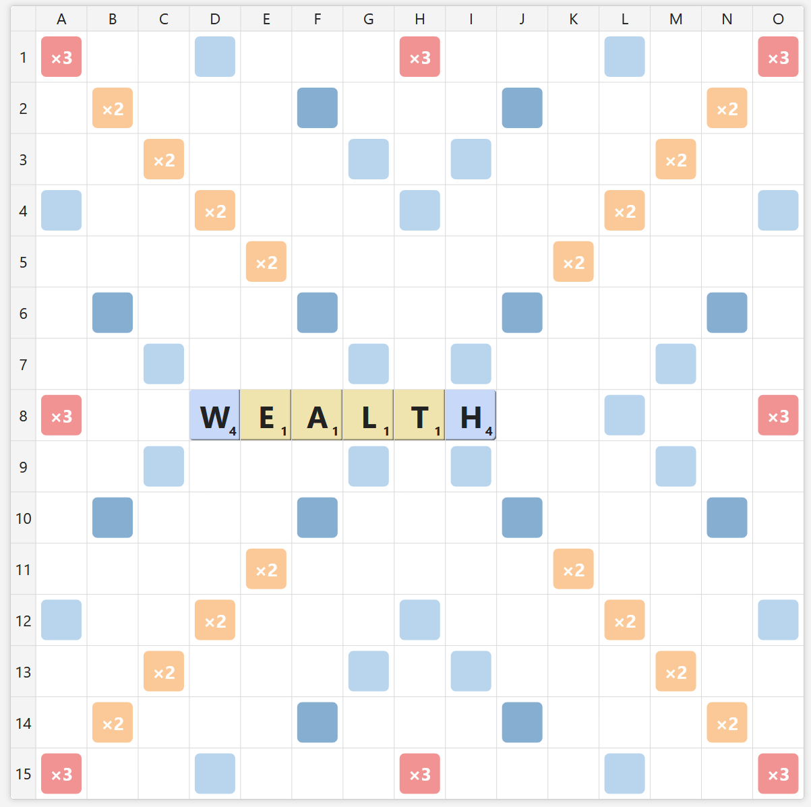  

Then after playing `WEALTH`, P1 would draw 6 tiles from the bag, to get their rack back up to 7 tiles in total.

#### After the first move...

Now that there's a word on the board, the words played afterwards must be connected to some tile already present on the board.

We can explore some options on how to play our tiles as P2.

Consider the following rack.

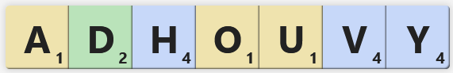

We have a multitude of options to play here, but let's consider the word `AHOY`.  

We are presented with 3 ways of playing the word `AHOY`.

1. The Intersection (Using the `A` in wealth, to create the new word `AHOY`, using `H`, `O`, and `Y` on your rack)  
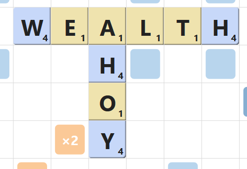

2. The Hook (Playing `AHOY` from the rack, while hooking `Y` at the end of the word `WEALTH`, creating the new word `WEALTHY`)  
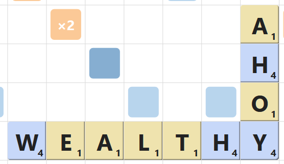

3. The Overlap (Playing `AHOY` from the rack, placed above the `W` and `E` of `WEALTH`, creating the new words `OW` and `YE`)  
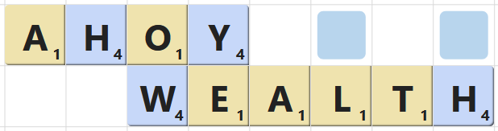

Of course, all 3 plays are valid (because the words created are all valid). But typically speaking, the overlap play is better than the other 2 options because it usually scores the most points.

And after playing the `AHOY`, P2 would draw 4 new tiles from the bag, to replenish their tiles.

Here is the final state of the board after the turns of both players.  

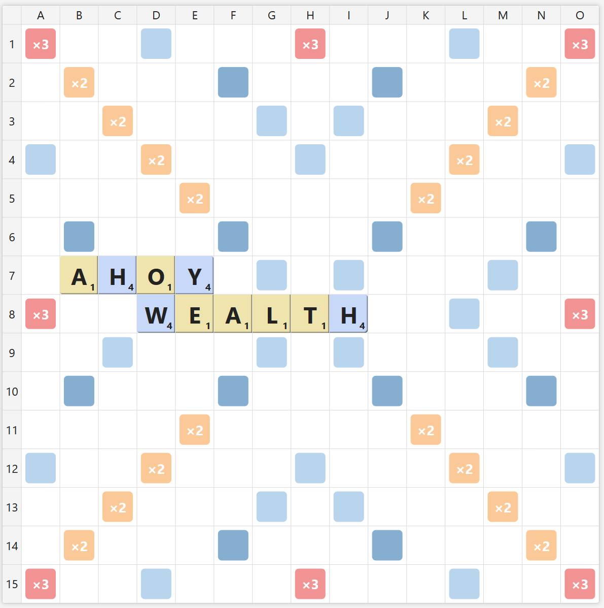  

#### Extension Play

If your tiles allow, you can also extend a word into a longer, valid word.

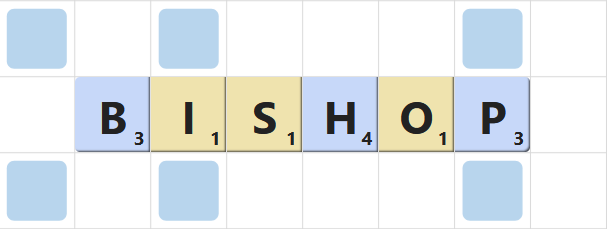 -> 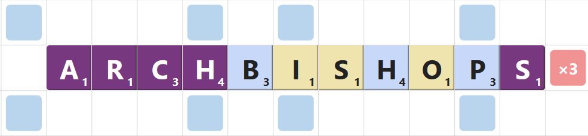 

### EXCH

When there are more than 7 tiles in the bag, the player can choose to exchange any number of tiles from their rack.

How it works:

1. They first choose which tiles from their rack they want to exchange (and how many tiles they want to exchange).
2. Draw that many new tiles from the bag.
3. Put the old tiles that they wanted to exchange back into the bag.

For example:

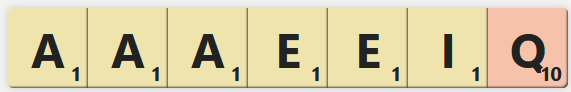  

This rack is pretty bad due to the abundance of vowels and repeating tiles, and plays with these tiles usually yield low scores. Therefore, the player might want to exchange the tiles.

They can choose to exchange all of the tiles (all 7, `EXCH AAAEEIQ`), or only a select few (maybe only `EXCH AAEQ`, to remove the duplicates and the clunky `Q`)

#### What if there's not enough tiles?

The player can only exchange as many tiles as there are tiles in the bag (max(7,`remaining tiles in bag)).  
So, if there are only 3 tiles in the bag, you can only exchange up to 3 tiles.

### PASS

At any point of the game, a player can choose to pass their turn. If so, the turn is immediately passed to the other player. (Pretty self-explanatory)

## Scoring

Scoring is pretty simple. For every new word created that turn, you sum up the scores of each individual tile, and then the total, is the score earned that turn.

There are also the tile modifiers. 

- `DOUBLE LETTER` and `TRIPLE LETTER` doubles, and triples, the tile's score that is placed directly on the tile.
- `DOUBLE WORD` and `TRIPLE WORD` doubles, and triples, the entire word's score, after the score of each individual tile is summed up.
- `DOUBLE WORD`'s and `TRIPLE WORD`'s multipliers are multiplicative, that means if a word happens to land on 2 `TRIPLE WORD` tiles, the word will have a x9 multipler.

The letter modifiers are applied before the word modifiers. And the modifiers are only applied when a new tile is placed on said tile.

Let's use the example we used before, `WEALTH` on D8, horizontally.  
  

We have `W` on a double letter tile, and the `H8` centre square is actually a double word tile.  
Therefore the total score of the play is: ( 4\*2 (`W` on double letter) + 1 (`E`) + 1 (`A`) + 1 (`L`) + 1 (`T`) + 4 (`H`) ) \*2 (Double word) = 32.

And now for P2's overlapping play.  
  

Let's see how many points each new word scores.

- `AHOY`: ( 1 (`A`) + 4*2 (`H` on double letter) + 1 (`O`) + 4 (`Y`) ) = 14
- `OW`: 1 (`O`) + 4 (`W`) = 5
- `YE`: 4 (`Y`) + 1 (`E`) = 5

Therefore, the play `AHOY` by P2 has a score of 14 + 5 + 5 = 24  
> Notice that the `DOUBLE LETTER` modifier no longer applied to the `W` for the calculations of the word `OW`.  
> This is because the `W` is not newly placed this turn, thus the modifier is inactive.

One more example:

Placing `Q` on a double letter tile to form `QI` and `QI`
> This is only selected portion of the board to highlight the `QI` play, the 4 letter string `EIAD` is not a real word because it is a part of a longer word that is not entirely shown on the pictures provided :P

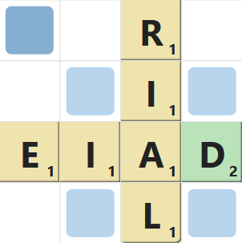 -> 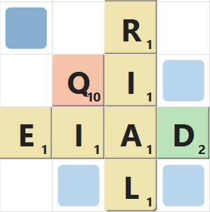  

This play is worth:

- First `QI`: 10*2 + 1 = 21
- Second `QI`: 10*2 + 1 = 21

Total: 42

The double letter on the `Q` is counted twice, because the `Q` is newly placed onto the double letter that turn, and both of the `QI`s uses the newly placed `Q` tile.

### Bingo

When a player uses all 7 of their tiles to make a word, they get a bonus of 50 points (called a `Bingo`). Consider the following example.

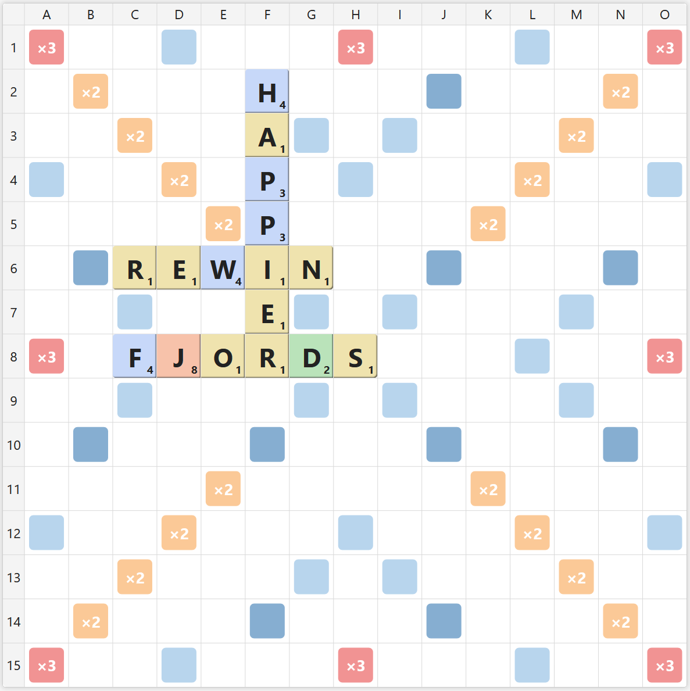  

with a rack of  

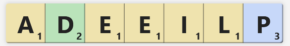

You can play the word `PLEIADES` using the `S` from `FJORDS`.

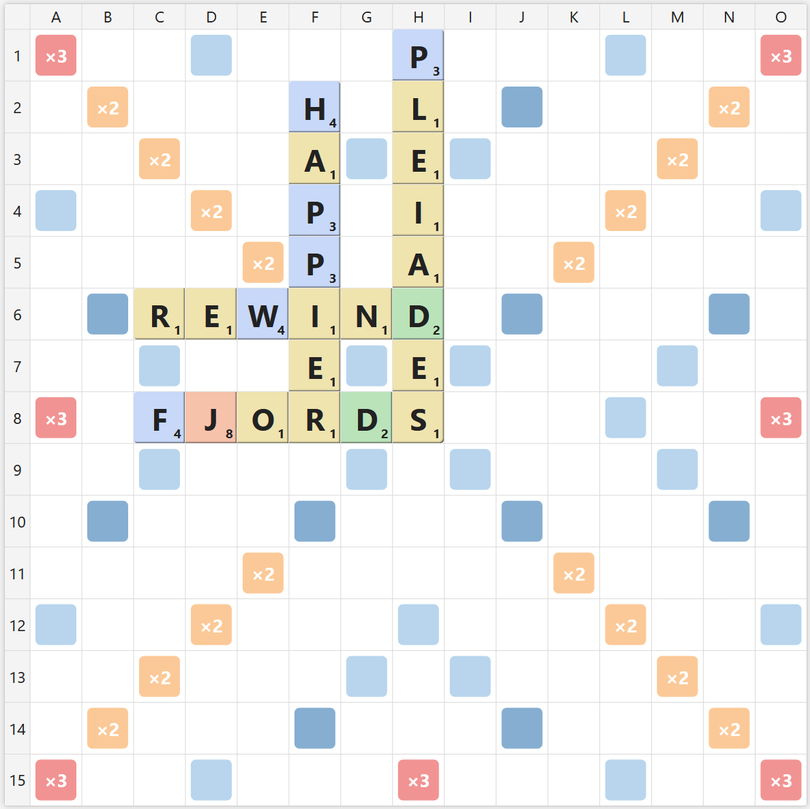  

This play would score you:

- `PLEIADES`: ( 3 + 1 + 1 + 1*2 + 1 + 2 + 1 + 1 ) \*3 = 36
- `REWIND`: 1 + 1 + 4 + 1 + 1 + 2 = 10

Total = 36 + 10 + 50 (using all 7 tiles) = 96.

The 50 bonus points added on last and are not modified by any of the tile modifiers.

## Winning conditions

Normally, the game ends when one of the players played all their remaining tiles, and there are no more tiles in the bag left to draw.  

In that situation, the player who placed all their tiles, will receive a bonus of double the total score of the opponent's remaining tiles.

So, in a situation where P1 plays out, and P2 has a remaining rack of:

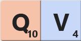  

P1 will receive ( 10 + 4 ) * 2 = 28 extra points, on top of their total score.

### Passing clause

If both player passes their turns, twice in a row (aka, P1 passes, P2 passes, P1 passes again, P2 passes again), the game forcibly ends.

Then, both of the players will receive a penalty of -2 * (`sum of their remaining tiles`).

## Something to add idk
