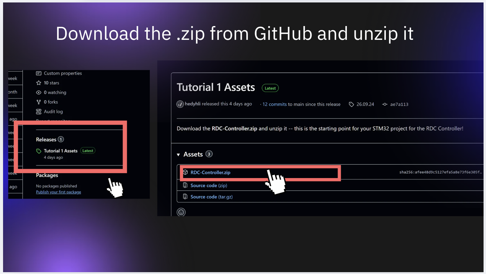
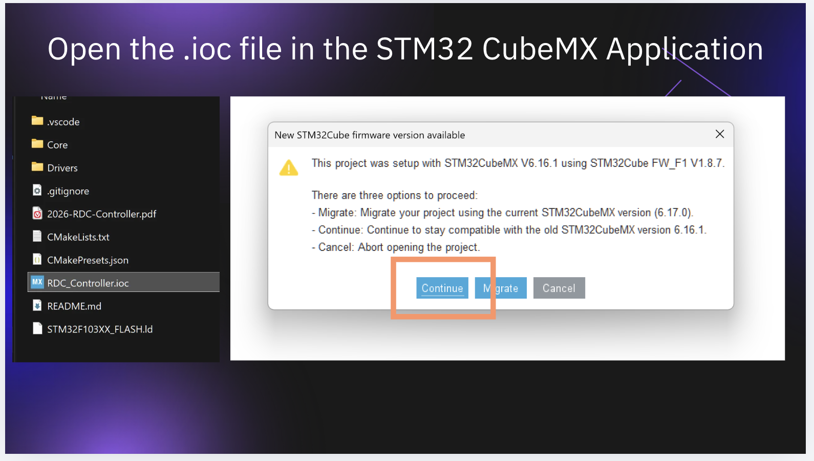
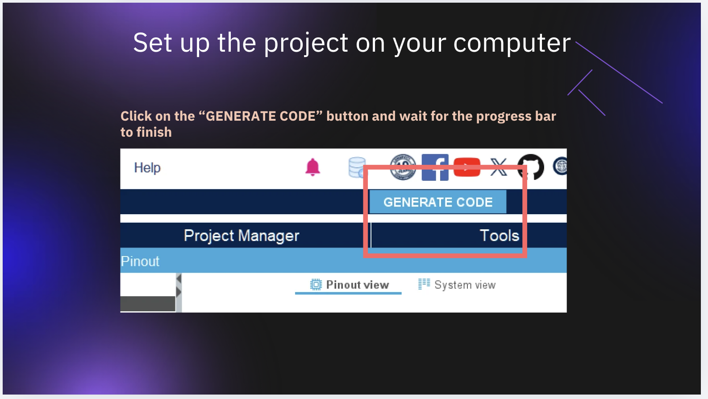
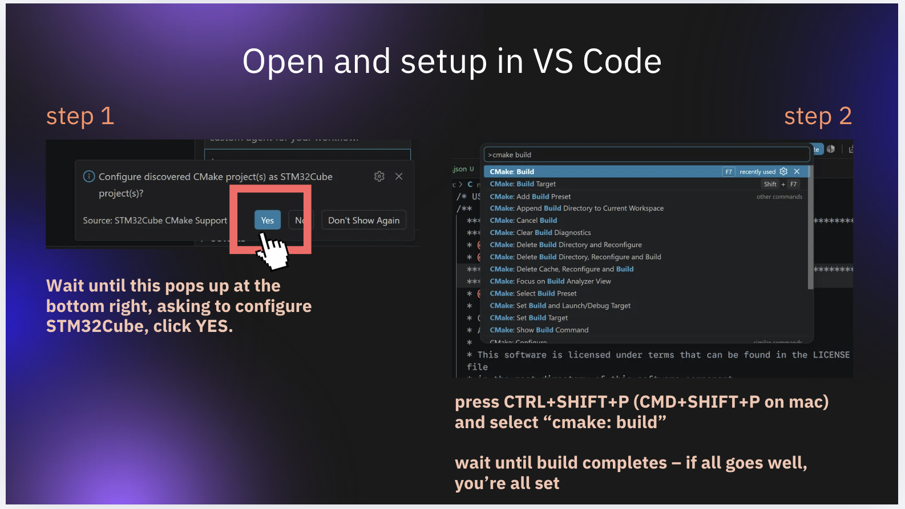
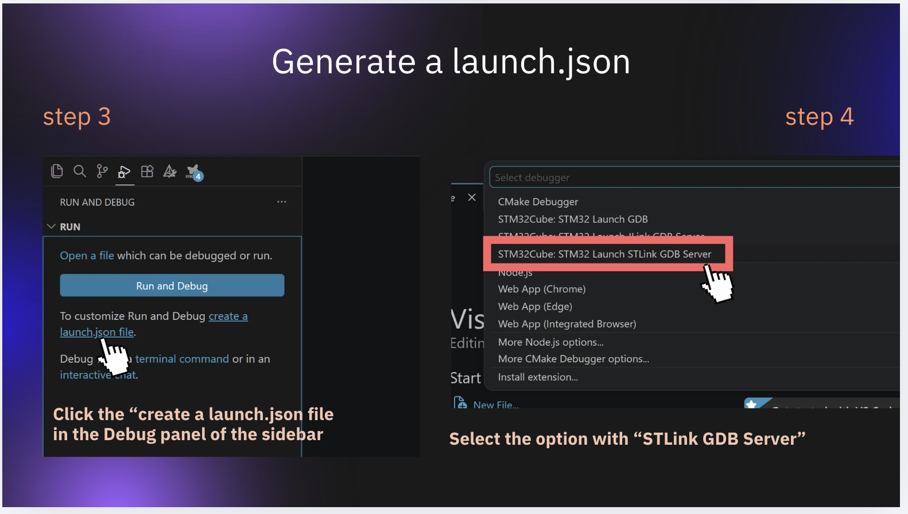
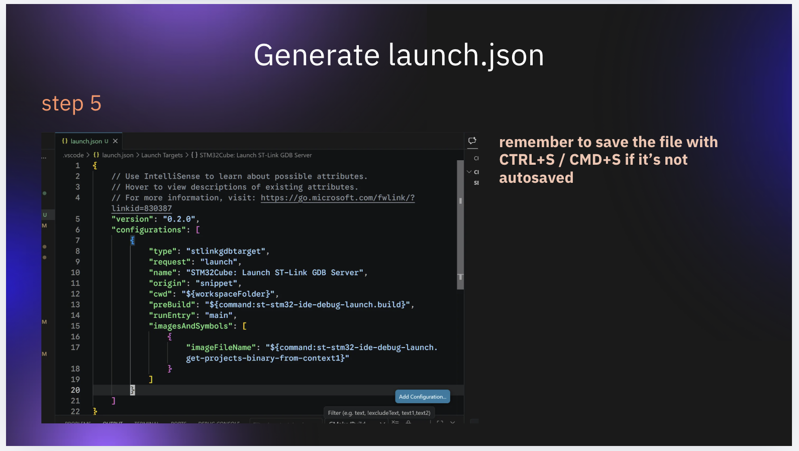
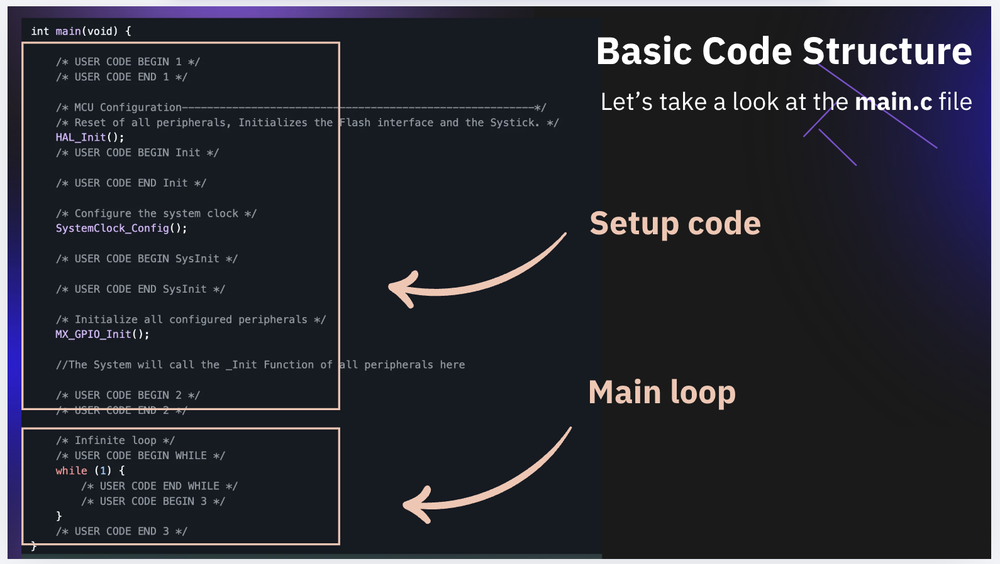

[Back to Tutorial 1](./) | [Next: GPIO](01-gpio.md)

---

For this first section of the tutorial, please follow along the canva presentation slides! 

https://canva.link/oon1xmuchxtwbk8

**Outline**
- Introduction to STM32 and using STM32 in robotics
- A brief overview of a typical STM32 project
- **Important!** Set up your STM32 project for the RDC Controller in VS Code following the instructions on the slides, after downloading the [RDC-Controller.zip](https://github.com/UST-Robotics-Team/Software-Tutorial-2026-Notes/releases/tag/26.09.24) skeleton.

If you came late or missed some of the earlier instructions due to some special circumstances, **please complete the steps on your own**-- the STM32 setup instructions are copied below for your reference -- don't miss any steps!

## 1. Download and unzip

[Link to the Tutorial 1 `.zip`](https://github.com/UST-Robotics-Team/Software-Tutorial-2026-Notes/releases/tag/26.09.24)

Save the file and unzip it somewhere sensible **on your local computer**.

> [!IMPORTANT]
> 
> Do NOT use a location on OneDrive for your Robotics projects (including this one)!!!!

## 2. Open in STM32 CubeMX

Once you've unzipped the file, open the `.ioc` in CubeMX. If you're on mac, you will need to open CubeMX separate, then use "File -> Open project" and locate where your `.ioc` file is.

> [!warning]
> 
> When prompted about STM32Cube firmware version (see the image below), select "Continue"

Note that the first time you open CubeMX, you will be required to register for an account. Please register for the account and log in.

## 3. Generate code

Press the generate code button to set up the project on your computer.

## 4. Open the folder in VS Code

Now, we can open the RDC-Controller project in VS Code. On Windows, you can simply right click on an empty space in the folder and click "Open with Code". On Mac, you should use "File -> Open Folder" and locate the RDC-Controller folder (contents of the unzipped file).

1. After opening the project for the first time in VS Code, you need to **wait** until you see a popup on the bottom right, saying "Configure discovered CMake project(s) as STM32Cube project(s)?" -- click YES.
2. Wait for a minute or two for that setup to complete
3. To test your setup, open the command palette with `ctrl+shift+p`/`cmd+shift+p`, and run "CMake: Build"
4. When prompted to select build target (Debug/Release etc), select "**Debug**"
5. Once the build completes successfully, you're all set for this step

## 5. Generate a `launch.json` to flash code

In order to run your code on the hardware later, you need to make VS Code generate a `launch.json` file. On the left sidebar of VS Code, go to the triangle icon ("Run and Debug"), and select **"create a launch.json file"**

Next, you will be prompted to select a debugger. **Make sure you select the option with "STLINK GDB Server".

You will soon see an editor open up that looks something like this. Save it with `ctrl+s`/`cmd+s`, and close the file. That's all we need to do for this step.

> [!NOTE]
> 
> The `launch.json` file is generated automatically by following the step 3 and step 4 in the image above -- there is not need to add it and edit it yourself!

## Take a look around

If you've completed all the steps and are waiting for others, feel free to take a look around at the files in the project. Most of these files are automatically generated libraries that you won't ever need to touch.

The file we will be working on is `Core/Src/main.c` -- that is where you will write your program!

> [!tip]
> 
> At this stage, you will not need to care about automatically generated code outside the `int main(void)`.

The `int main(void)` defines your program entrypoint, this is where we do most of the work!

At the bottom of the `int main(void)` function, you will see a `while (1)` loop. This is an infinite loop that serves as the main loop for your robot or your controller.

Notice the `USER CODE BEGIN WHILE` and `USER CODE END WHILE`. This is for CubeMX to know where you've written your code, so each time you need to re-generate the project, it can keep the code you write and avoid overwriting it.

Any code you write in the while loop **MUST BE** before the `USER CODE END WHILE` line.

> [!tip]
> 
> All the code in the main loop (within `while (1)`) braces will be executed on **every iteration** of the while loop -- it will run repeatedly!

If you're curious, you may take a look at some of the other files -- just make sure you don't accidentally modify anything!

---

[Back to Tutorial 1](./) | [Next: GPIO](01-gpio.md)
