[Back to Tutorial 1](./) | [Previous: Introduction](00-introduction.md) | [Next: Clock](02-clock.md)

**This section contains Classwork 1**

# 1. GPIO

**Outline**
- GPIO Pin naming
- Changing pin labels in STM32CubeMX
- GPIO Output with HAL
- `HAL_Delay()`
- Example: Blinker
- GPIO Input with HAL
- Example: Button indicator
- Pneumatic valves
- **Classwork 1**

## Introduction to GPIOs

Microcontrollers use GPIO "pins" to interact with external components. A single pin is identified by a specific naming convention.

> **What is a pin?**
> 
> Take a look at the PCB below. You can see a lot of tin lines that aligns with the mcu, those are what we can pins, which is the only channel how the MCU connect with all the peripherals and make interaction with any things.
> 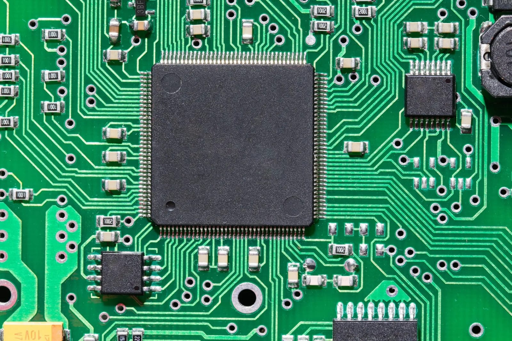

### Anatomy of a Pin Name: e.g. `PA12`

- **P** - Port (the group the pin belongs to)
- **A** - The specific Port identifier (e.g., Port A)
- **12** - The Pin Number within that port


### Primary Pin Modes

GPIO pins can generally operate in one of two fundamental states:

| **Mode**        | **Function**                                    | **What it tells you**                     |
| --------------- | ----------------------------------------------- | ----------------------------------------- |
| **GPIO Output** | Drives an external device (turns it ON or OFF). | _"Tell something else to turn on or off"_ |
| **GPIO Input**  | Reads the state of an external device.          | _"Is it on or off?"_                      |

General-Purpose Input/Output (GPIO) pins are essential components in embedded systems, allowing for interaction with the external environment. These digital signal pins can be configured as inputs or outputs, enabling the microcontroller to read or send discrete signals, typically represented as `HIGH (1)` or `LOW (0)`.

### Pin labels

To make pins easier to work with, we give them names (rather than having to use `PA12` etc each time).

If you open the project in CubeMX, you will notice a lot of labels for the pins are already configured for you.

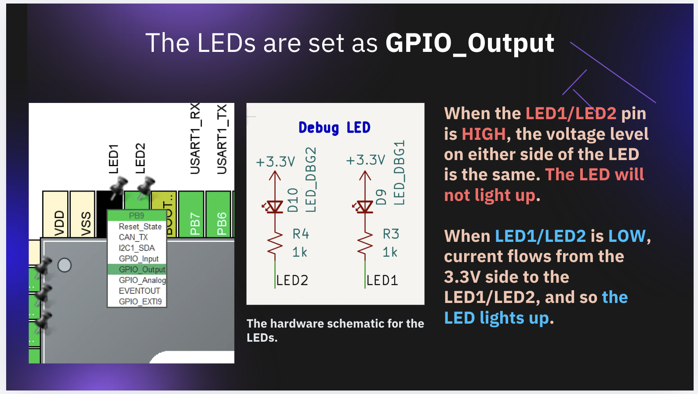

Take a look at `LED1` in CubeMX. Click on `PB9`, the pin for `LED1`, and ensure it's set to `GPIO_Output`.

You may choose to give the pin another name, but remember that you will use that name later in your code.

>[!NOTE] 
> Your changes here will be in effect when you regenerate code in CubeMX


## GPIO Output

We can use the HAL library to program a GPIO pin. For instance, to set the pin `PB9` to be "ON", or "OFF" you can use the following functions:

```c
// Set it to on
HAL_GPIO_WritePin(GPIOB, GPIO_PIN_9, GPIO_PIN_SET);
// Set it to off
HAL_GPIO_WritePin(GPIOB, GPIO_PIN_9, GPIO_PIN_RESET);
// Toggle it
HAL_GPIO_TogglePin(GPIOB, GPIO_PIN_9);
```

After giving the pins a name in the CubeMX, we can simply use `LED1_GPIO_Port` and `LED1_Pin` rather than `GPIOA` and `GPIO_PIN_12`.

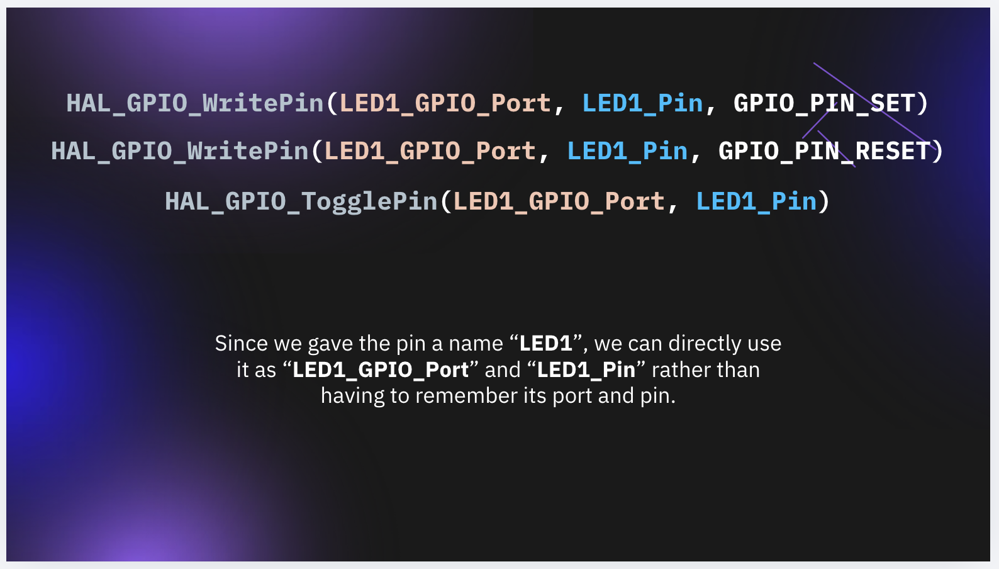

```c
// after naming the pins, CubeMX helps you write this in Core/Inc/main.h
#define LED1_Pin GPIO_PIN_9
#define LED1_GPIO_Port GPIOB


// then in main.c, simply use, e.g.
HAL_GPIO_TogglePin(LED1_GPIO_Port, LED1_Pin);
```

Make sure to press "**generate code**" every time you make changes in the CubeMX.

### HAL_Delay

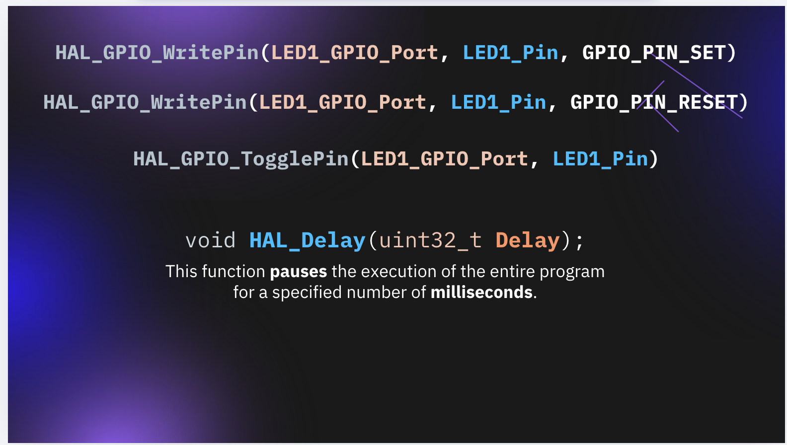

The `HAL_Delay` function pauses the execution of the program for a specified number of **milliseconds**.

```c
// definition (provided for you)
void HAL_Delay(uint32_t Delay);

// usage
HAL_Delay(1000); // pause for 1 second
```

### Demo: Blinking two LEDs

Putting what we have learned so far together, you can easily create a blinker program:

```c
    /* Infinite loop */
    /* USER CODE BEGIN WHILE */
    while (1) {
        HAL_GPIO_WritePin(LED1_GPIO_Port, LED1_Pin, GPIO_SET);
        HAL_GPIO_WritePin(LED2_GPIO_Port, LED2_Pin, GPIO_SET);
	    HAL_Delay(1000);
	    HAL_GPIO_WritePin(LED1_GPIO_Port, LED1_Pin, GPIO_RESET);
	    HAL_GPIO_WritePin(LED2_GPIO_Port, LED2_Pin, GPIO_RESET);
	    HAL_Delay(1000);
        /* USER CODE END WHILE */
        /* USER CODE BEGIN 3 */
    }
```

Remember to put any code BEFORE the "END WHILE" line, otherwise, it will be removed every time you regenerate the project with CubeMX!

### A reminder on flashing code

You should have read the "Flashing Code" guide from Tutorial 0, here is a quick reminder on how to flash code.

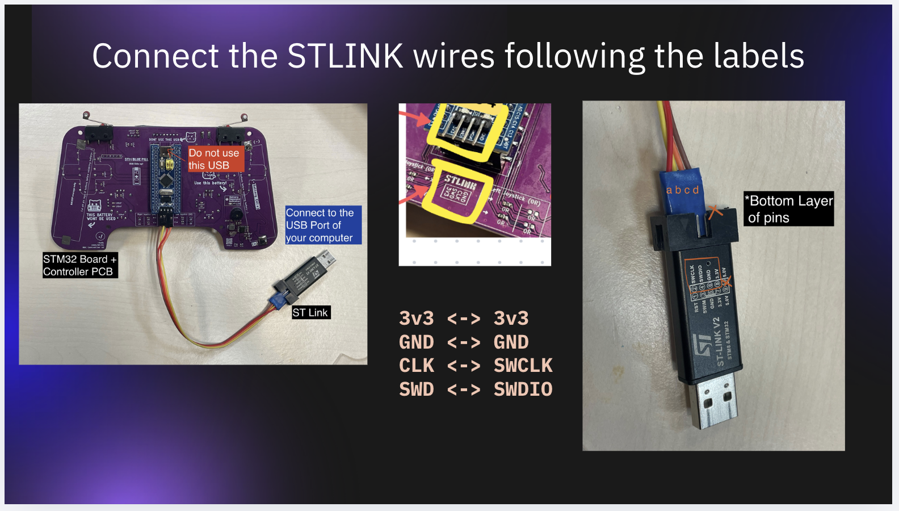

Make sure the wire connections are correct!

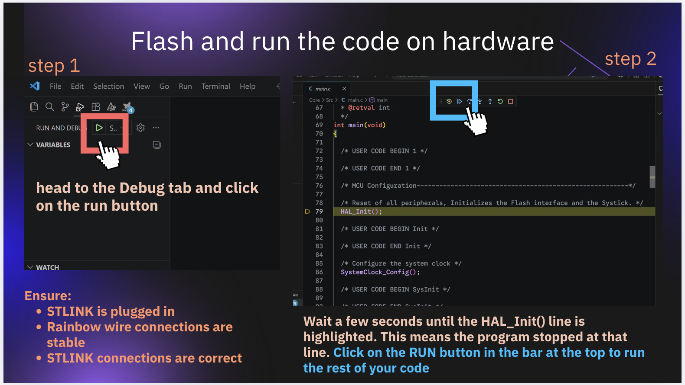

In Summary:
- Use the "Run and debug" function to flash code
- Click on the the triangle run button when the code stops at `HAL_Init()`
- Ensure all wire connections are correct and stable before attempting to "Run and debug"

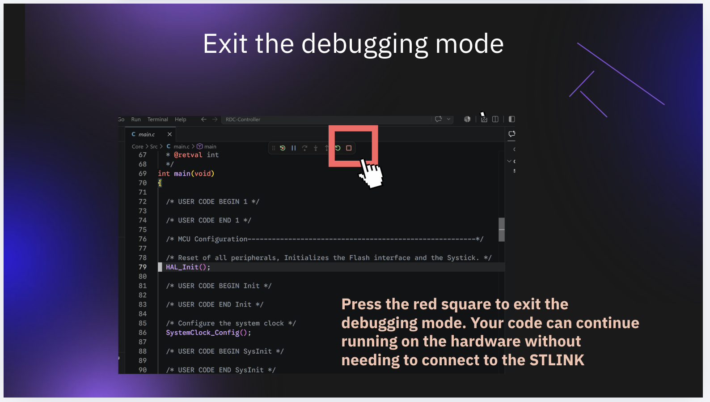

To exit, click on the red square. The next time you wish to flash code, repeat the entire procedure.

### Macros to make life easier

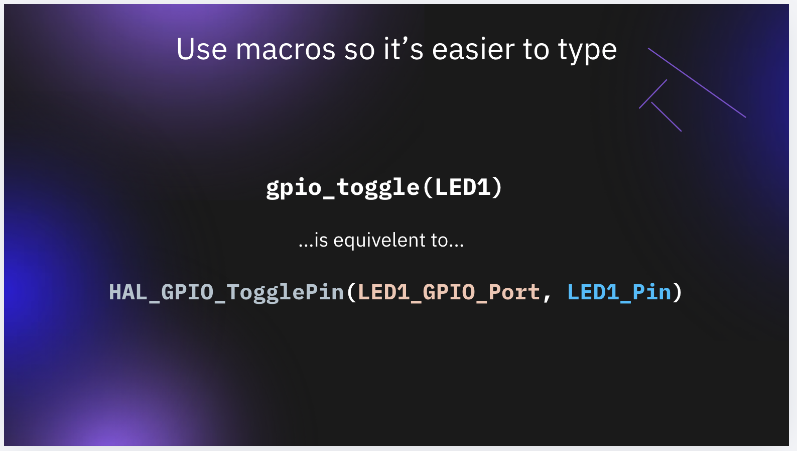

`HAL_GPIO_WritePin` is very long to write, and we need to repeat the pin name (`LED1`) twice. As software engineers we like to keep things simple and clean and avoid repeating ourselves.

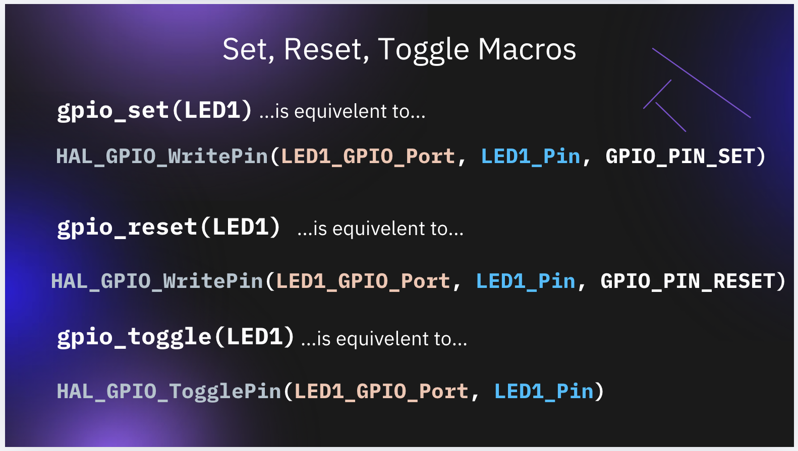

Here are a few macros to make things easier, we have already provided these in your `main.h`:

```c
#define gpio_set(gpio) HAL_GPIO_WritePin(gpio##_GPIO_Port, gpio##_Pin, GPIO_PIN_SET)
#define gpio_reset(gpio) HAL_GPIO_WritePin(gpio##_GPIO_Port, gpio##_Pin, GPIO_PIN_RESET)
#define gpio_toggle(gpio) HAL_GPIO_TogglePin(gpio##_GPIO_Port, gpio##_Pin)
```

This way, the blinker code can simply be written as:

```c
    /* Infinite loop */
    /* USER CODE BEGIN WHILE */
    while (1) {
        gpio_set(LED1);
        gpio_set(LED2);
	    HAL_Delay(1000);
	    gpio_reset(LED1);
	    gpio_reset(LED2);
	    HAL_Delay(1000);
        /* USER CODE END WHILE */
        /* USER CODE BEGIN 3 */
    }
```

Or alternatively, simply use toggle:

```c
    /* Infinite loop */
    /* USER CODE BEGIN WHILE */
    while (1) {
        gpio_toggle(LED1);
        gpio_toggle(LED2);
	    HAL_Delay(1000);
        /* USER CODE END WHILE */
        /* USER CODE BEGIN 3 */
    }
```

### `led_on` macros

You may notice that we need `GPIO_PIN_SET` to turn the led off, and `GPIO_PIN_RESET` to turn the LED off. This is because in the hardware schematic, the positive side of the LED is connect to a constant 3V3, and the negative side is connected to the MCU pin.

To make this more intuitive and maintainable, you should define your own `led_on`, `led_off`, and `led_toggle` macros.

Add this to `main.h`:

```c
// notice that reset the pin turns the led on
#define led_on(led) gpio_reset(led)
#define led_off(led) gpio_set(led)
#define led_toggle(led) gpio_toggle(led)
```

This way, you can simply use `led_on(LED1)` and it will turn on the LED.

When your hardware teammates changes the PCB in the future where `gpio_set` would turn on the LED instead, you can simply update the macro here, and there's no need to change every `gpio_set` or `led_on` call throughout the rest of your code.

## GPIO Input

After we know how to program a GPIO output pin, we now move forward to reading user input using GPIO input pins.

Pick a button to configure, in this picture we pick `PB5`, which happens to be Button 5 labelled on the PCB.

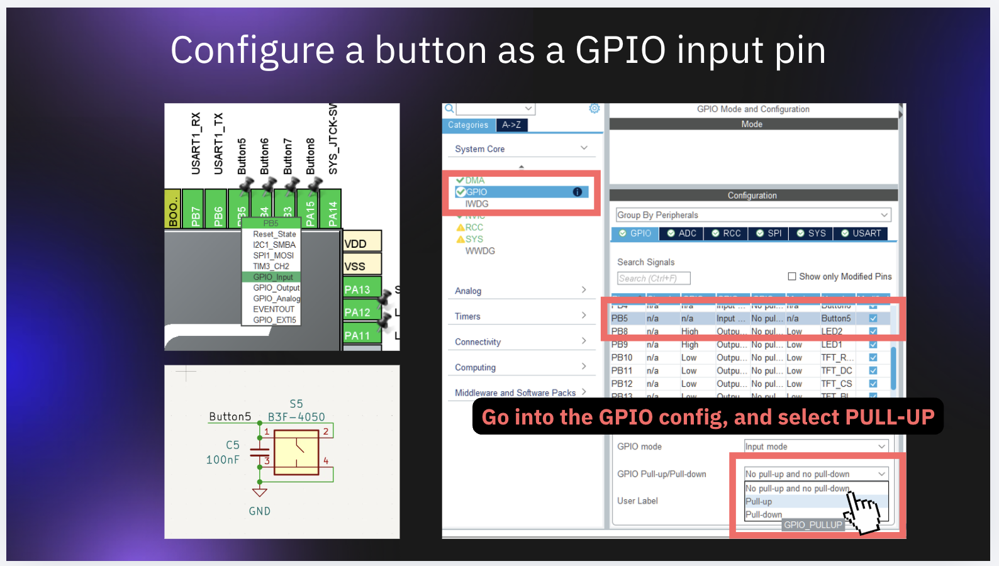

1. Click on the button pin, and ensure `GPIO_Input` is selected
2. In the GPIO section of "System Core", find **PB5** and select "**Pull-up**"
3. Press "**GENERATE CODE**" for CubeMX to update your project based on these settings.

> [!Note]
> Again, make sure any of your existing code is between the "BEGIN" and "END" comments, otherwise, it will be overwritten.

### Read input with `HAL_GPIO_ReadPin`

Just now, the function we use is `HAL_GPIO_WritePin`, for GPIO input, we use `HAL_GPIO_ReadPin`.

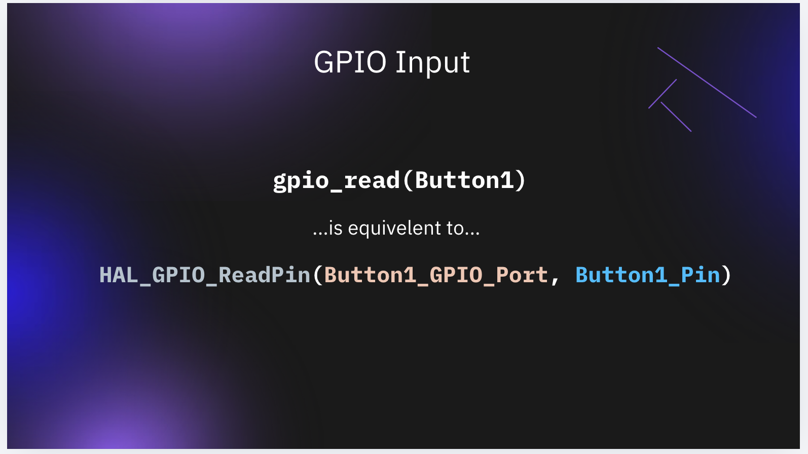

For reading input, we have similarly provided shortcut macros to make your life easier in `main.h`:

```c
#define gpio_read(gpio) HAL_GPIO_ReadPin(gpio##_GPIO_Port, gpio##_Pin)
```

And so to read the current state of a button, either of these would work:

```c
uint8_t btn_state = gpio_read(Button5);

// OR

uint8_t btn_state = HAL_GPIO_ReadPin(Button5_GPIO_Port, Button5_Pin);
```

### Demo: Button indicator

Now that you know we can use `gpio_read` to check the state of a button pin, and `led_on`/`led_off` to program the LED, try and figure out how to program a button indicator. The LED should turn on if the button is pressed, otherwise, the LED should be off.

<details><summary>Show answer</summary>


```c
/*main.c*/
while(1){
    if (gpio_read(Button5)) {
        led_on(LED1);
    }
    else {
        led_off(LED1);
    }
}
```

</details>

> [!Warning]
> Anything you write in the while-loop should be before the `END WHILE` comment.

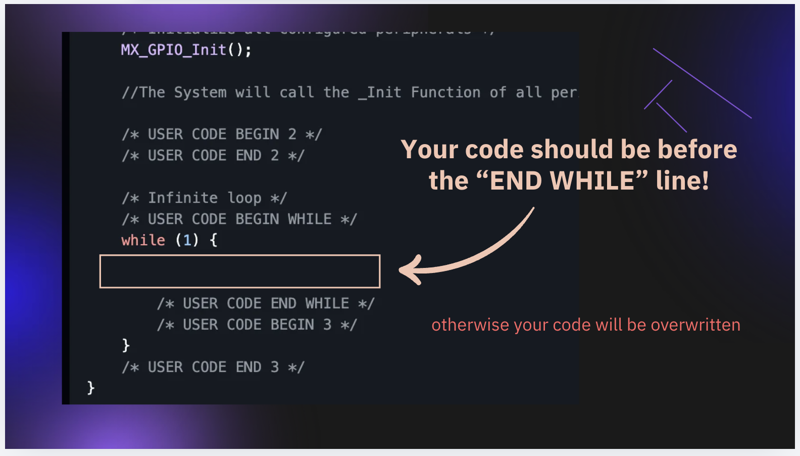

### `btn_read` macro

Similar to the `led_on`/`led_off` macro, you may notice that when the button is PRESSED, the output of `gpio_read` is actually `GPIO_PIN_RESET`, and when button is not pressed, it's `GPIO_PIN_SET`.

Add the following macro to your `main.h`, so you can directly use `btn_read` in your code:

```c
#define btn_read(btn) !gpio_read(btn)

// OR:
#define btn_read(btn) (gpio_read(btn) == GPIO_PIN_RESET)
```

So that you can directly check `btn_read(Button5)` for example, and a truthy value means the button is pressed.

### Further Reading: Pneumatic Valve Application

Another application you might use in the Robot Design Contest and your future journey in robotics for GPIO is pneumatic valves.

A pneumatic valve is a device that controls the flow of compressed air in a pneumatic system. By providing a signal, you can control the air flow passage between various components such as cylinders or actuators. Below is the picture of a pneumatic valve, and you can see two air input holes on top and one air output on the buttom:

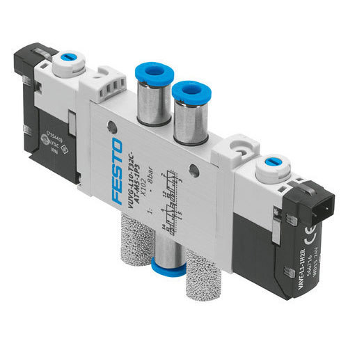

Usually, we will connect the output of the valve to an air cylinder, which will expand when high pressure air flows in, and contract when the pressure is released. A clear gif is provided below for your understanding on how it works.

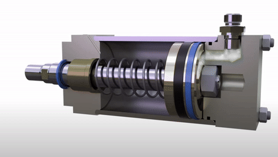

So with this this valve and air cylinder, you are able to make different mechanisms that only require simple movement. Take this robot gripper for example:

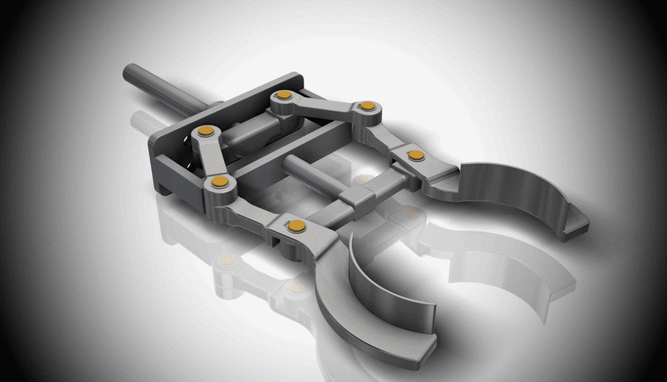

With the understanding on how this thing works, how can you control it? The control is really simple, the valve will be connected to one in-pair source(High pressure) when you give a `3V3` signal, and connected to another one air source when you give a `GND` signal. At the same time, the LED on the valve should turn on when it receives a `3V3` signal.

And so with a single GPIO output call, you can control a robot gripper.

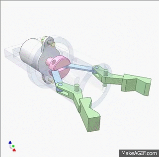


## Classwork 1: Limit Switch Indicator

Now it's your turn! For your first *graded classwork*, you will make an LED Indicator for each of the limit switches.

Your task is to use **LED1** for the **Left Limit Switch** and **LED2** for the **Right Limit Switch**. The LED should be on when the switched is pressed down, off otherwise. Note you should remember to always check pin configurations in CubeMX before using those pins.

The full mark for this classwork is 3. The first mark is a partial mark.

- Each of the LED changes in some way independently of each other when either one of the limit switches are pressed **@1**
- **LED1** is ON when **Left Limit Switch** is pressed down, OFF otherwise **@1**
- **LED2** is ON when **Right Limit Switch** is pressed down, OFF otherwise **@1**

Ask for a senior to mark your work when you're done.

**Reminder: Please save your code for Classwork 1 in a separate file somewhere before heading to the next part of the tutorial!**

---

[Back to Tutorial 1](./) | [Previous: Introduction](00-introduction.md) | [Next: Clock](02-clock.md)
