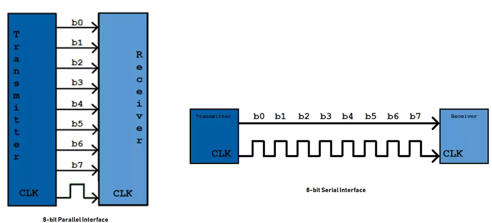
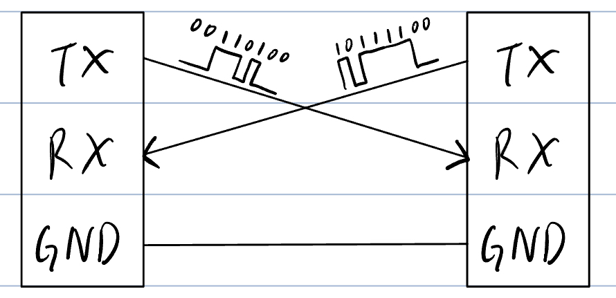
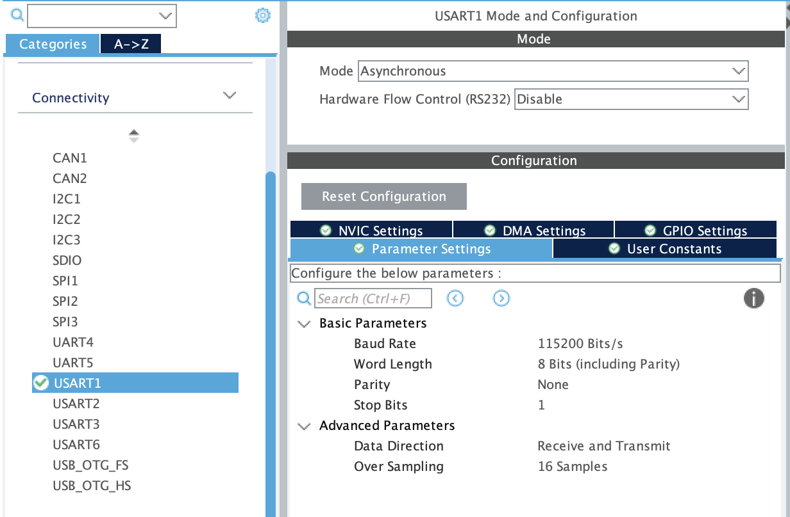
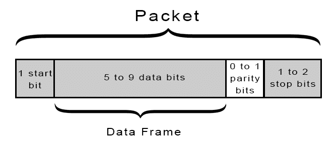

# UART

[Back to Main](./README.md)

> Author: Ken Law (cclawad@connect.ust.hk) \
> Modified by Ken Yu (ksyuad@connect.ust.hk)

## Intuition

In tutorial 1, you have already learnt how to control buttons and LEDs on the mainboard, it is a kind of information exchange between you and MCU. However, what about data transfer between 2 MCU? Or even send data from the MCU to your computer for debug purpose?

## Introduction

Suppose you want to send 8-bit data from one board to another. Using the simplest parallel communication method, you’d need 8 wires—one for each bit:



This quickly becomes impractical as data width increases. For example, sending 32 bits would require 32 wires, just for one-way communication. To solve this, we use **Serial Communication Protocols** like UART, which allow devices to communicate efficiently with far fewer wires.

## What is UART?

UART (Universal Asynchronous Receiver-Transmitter) is a simple and popular serial communication protocol. It allows microcontrollers like the STM32 to send and receive data using just three wires: TX (transmit), RX (receive), and GND (ground). Unlike parallel communication, UART sends data as a **Stream of Bits**, reducing hardware complexity at the cost of transmission speed. UART is widely used for debugging, data logging, and connecting wireless modules such as Bluetooth.

> How is data represented as bit stream: [ASCII](https://en.wikipedia.org/wiki/ASCII) \

## UART Connections

To communicate via UART, connect the devices as shown below:



> The GND connection ensures both devices share the same reference voltage. Without a common ground, signals may be misinterpreted, so **always** connect GND between devices.

> Sometimes you may want to connect some module that has no power source on its own to the MCU. In this case, one more `5V/3.3V` wire is needed for powering the module with the MCU. (MCU 3.3V <-> module 3.3V)

## UART Configuration



To configure UART on STM32, open the `.ioc` file in the root directory of the project, go to `Connectivity > USART/UART X` and set the mode to `Asynchronous`.

> USART stands for Universal **Synchronous**/Asynchronous Receiver-Transmitter. Synchronous mode requires an extra clock line, while asynchronous mode (used here) relies on both devices agreeing on the baud rate.

UART transmits data in **Packets**. Each packet typically includes 1 start bit, 5–8 data bits, an optional parity bit, and 1/1.5/2 stop bits.



Most settings can remain at their defaults, except for the **Baud Rate**, which must match on both devices.

### Baud Rate

The baud rate defines how many bits are sent per second. Common values include:

- **9600**
- 14400
- 19200
- **38400**
- 57600
- **115200** (recommended)
- 128000
- 230400
- 256000
- 460800

`115200` is widely supported and fast enough for most applications. For example, with 1 start bit, 8 data bits, no parity, and 1 stop bit (10 bits total per byte), you can send 11,520 bytes per second at 115200 baud.

> **Always** set the same baud rate on both sides of the connection.

## Initializing UART Pins

Before using UART, you must initialize the relevant pins. This is usually handled in `main.c`:

```c
MX_USART1_UART_Init();
```

## Sending and Receiving Data

After initialization, use the STM32 HAL library function to transmit and receive data.

### Transmitting Data

```c
HAL_UART_Transmit(UART_HandleTypeDef *huart, uint8_t *pData, uint16_t Size, uint32_t Timeout);
```

- `huart`: UART handler (e.g., `&huart1`)
- `pData`: Pointer to the data to send
- `Size`: Number of bytes to send
- `Timeout`: Maximum time to wait in ms (Max: `0xFFFF` -> 65535ms)

**Example:**

```c
int main(void)
{
    /* Initialization */
    ...

    char msg[] = "Hello, World!";

    while (1)
    {
        HAL_UART_Transmit(&huart1, (uint8_t *)msg, sizeof(msg), HAL_MAX_DELAY);
        HAL_Delay(1000);
    }
}
```

### Receiving Data

```c
HAL_UART_Receive(UART_HandleTypeDef *huart, uint8_t *pData, uint16_t Size, uint32_t Timeout);
```

- `huart`: UART handler
- `pData`: Buffer to store received data
- `Size`: Number of bytes except to receive before timeout
- `Timeout`: Maximum time to wait in ms

**Example 1:**

```c
int main(void)
{
    /* Initialization */
    ...

    char msg[5];

    while (1)
    {
        /* Expecting to receive 5 char */
        HAL_UART_Receive(&huart1, (uint8_t *)msg, 5, HAL_MAX_DELAY);

        /* Echo Back */
        HAL_UART_Transmit(&huart1, (uint8_t *)msg, 5, HAL_MAX_DELAY);
        HAL_UART_Transmit(&huart1, (uint8_t *)"\n", 1, HAL_MAX_DELAY);
    }
}
```

**Example 2:**

```c
int main(void)
{
    /* Initialization */
    ...

    char msg[128];

    while (1)
    {
        /* Receiving, waiting for the msg for at most 100ms before jumping to main logic */
        HAL_UART_Receive(&huart1, (uint8_t *)msg, sizeof(msg), 100);

        /* Main logic */
        if (msg...)
        {
            ...
        }
    }
}
```

## Place to put your own functions and variables

If you look close enough, you may saw that I have put all the `HAL_UART_TxCpltCallback()/HAL_UART_RxCpltCallback()` in something like

```c
/* USER CODE BEGIN XX */

/* USER CODE END XX */
```

This is because when you generating the code in the CudeMX, it will automatically delete all the stuff outside these BEGIN/END pair, even inside the `main()`.

```c
/* USER CODE BEGIN PV */
int test1; // Will stay
/* USER CODE END PV */
int test2; // Will be deleted

/* USER CODE BEGIN PFP */
int func1(){} // Will stay
/* USER CODE END PFP */
int func2(){}; // Will be deleted
```

## Data transfer between MCU and computer

You can also communicate between the STM32 mainboard and your computer using a USB-to-TTL module.

> A USB-to-TTL module converts between the microcontroller’s TTL signals and the USB signals your PC understands.

[Serial monitor setting](./02-serial-monitor.md)
