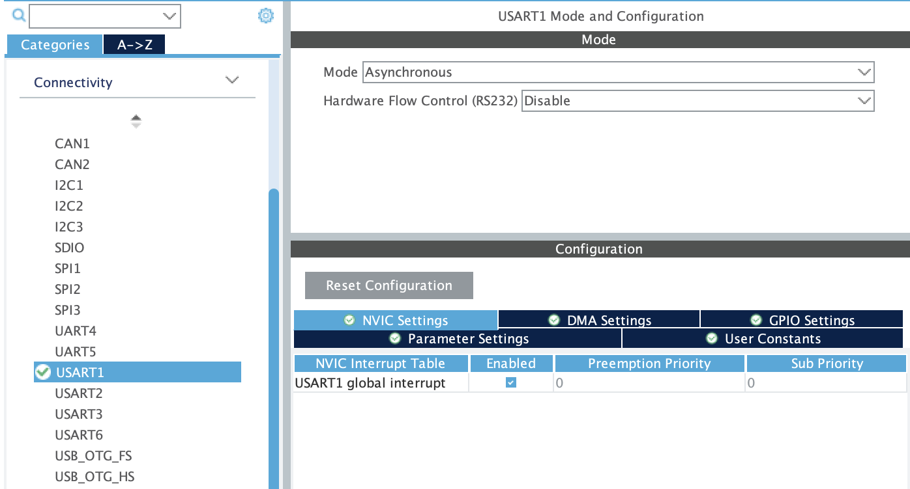

## Blocking vs. Non-Blocking Communication

When calling `HAL_UART_Transmit()/HAL_UART_Receive()`, your code will pause at the function call until data is successfully transmitted/received as the MCU is continuously asking the UART hardware peripheral whether a byte is sended/received, this is called `blocking function`. This is unaccetably inefficient espesially for receiving data as most of the MCU resources are wasted for waiting data income. (FYI most main logic finish under 5ms, except for image processing)

For low speed situations, setting a relatively low `Timeout` as above is accpectable. But for most robotics task, we would like to run the main logic as frequent as possible. In some situations this is problematic, for example:

```c
int main(void)
{
    /* Initialization */
    ...

    char msg[128];

    while (1)
    {
        // Code will stop at here waiting for at most 100ms
        HAL_UART_Receive(&huart1, (uint8_t *)msg, sizeof(msg), 100);

        // Main logic that needs to be run once per ms
        main_logic();
        HAL_Delay(1);
    }
}
```

Therefore, instead of blocking function, we mainly use **Non-blocking Transmit/Receive Function**. Instead of let the MCU keep asking whether we have completed sending/receiving data, the non-blocking function will send a interupt signal to MCU if the UART hardware have completed sending/receiving a **Fixed Length** data.

### Enabling UART Interrupts

Here's how to activate the interupt function. Go to `Connectivity > USART/UART X -> NVIC Settings` in the `.ioc` file, enable `USART/UART X global interrupt` then click the gear button marked as `Device Configuration Tool Code Generation` right next to the `Run` button(the green circle with a white triangle inside).



### Non-blocking Transmit function

```c
HAL_UART_Transmit_IT(UART_HandleTypeDef *huart, uint8_t *pData, uint16_t Size);
```

`HAL_UART_Transmit_IT()` transmits the given data **In The Background Using Interrupt Mode**.

All parameter are the same as the blocking version.

When it finish transmitting the data, the UART transmit interrupt will be triggered. Then the `HAL_UART_TxCpltCallback()`(Cplt stands for complete) callback function is **Automatically** called, which allows you to perform any necessary post-transmission actions.

> Actually we seldom use `HAL_UART_Transmit_IT()` as for short data transmission it is unnecessary to use this kind of function, while for long data we have another function called `HAL_UART_Transmit_DMA()` which use DMA(Direct Memory Access) for effective data transmission.

**TX Example:**

```c
#include <string.h>

/* USER CODE BEGIN PV */
int transmit_completed = 0;
/* USER CODE END PV */

/* USER CODE BEGIN PFP */
// You need to write this function yourself, it won't be auto generated
void HAL_UART_TxCpltCallback(UART_HandleTypeDef *huart)
{
    if (huart == &huart1) // Better check the UART handler as different UART handlers share the same callback function
    {
        transmit_completed = 1;
        led_on(LED1);
    }
}
/* USER CODE END PFP */

int main(void)
{
    /* Initialization */
    ...

    char shakespeare[] = ...; // Contains thousands of bytes

    // Activate sending in background
    HAL_UART_Transmit_IT(&huart1, (uint8_t *)shakespeare, strlen(shakespeare));

    while (1)
    {
        // Comment the original transmit function
        // HAL_UART_Transmit(&huart1, (uint8_t *)msg, strlen(msg), HAL_MAX_DELAY);
        main_logic();
    }
}
```

### Non_blocking Receive function

```c
HAL_UART_Receive_IT(UART_HandleTypeDef *huart, uint8_t *pData, uint16_t Size);
```

`HAL_UART_Receive_IT()` **Starts Listening** to receive the expected length of data **In The Background Using Interrupt Mode**.

All parameter are the same as the blocking version.

When it finish receving the **Fixed Length** of data, the UART receive interrupt will be triggered. Then the `HAL_UART_RxCpltCallback()`(Cplt stands for complete) function is **Automatically** called (but you need to manuly define it), which allows you to perform any necessary post-receive actions.

**RX Example 1:**

```c
/* USER CODE BEGIN PV */
char rx_buf[2];
/* USER CODE END PV */

/* USER CODE BEGIN PFP */
// You need to write this function yourself, it won't be auto generated
void HAL_UART_RxCpltCallback(UART_HandleTypeDef *huart)
{
    if (huart == &huart1) // Better check the UART handler as different UART handlers share the same callback function
    {
        post_receive_actions(rx_buf);

        // Start listening again
        HAL_UART_Receive_IT(&huart1, (uint8_t *)rx_buf, 2);
    }
}
/* USER CODE END PFP */

int main(void)
{
    /* Initialization */
    ...

    // Activate listening in background
    HAL_UART_Receive_IT(&huart1, (uint8_t *)rx_buf, 2);

    while (1)
    {
        // Comment the original receive function
        // Code will stop at here waiting for at most 100ms
        // HAL_UART_Receive(&huart1, (uint8_t *)rx_buf, sizeof(rx_buf), 100);

        // Main logic that needs to be run once per ms
        main_logic();
        HAL_Delay(1);
    }
}
```

Also, in pratice, we seldom put heavy work inside the `HAL_UART_RxCpltCallback()` function as we don't want the main logic to be interupted for so long. Therefore, the most common way to handle UART input is via **Flags**. In `HAL_UART_RxCpltCallback()`, we can do basic command processing to set the flags. After that, we let the main logic to handle those flags.

**RX Example 2:**

```c
/* USER CODE BEGIN PV */
char rx_buf[1];
int flag1 = 0;
int flag2 = 0;
/* USER CODE END PV */

/* USER CODE BEGIN PFP */
// You need to write this function yourself, it won't be auto generated
void HAL_UART_RxCpltCallback(UART_HandleTypeDef *huart)
{
    if (huart == &huart1) // Better check the UART handler as different UART handlers share the same callback function
    {
        if (rx_buf[0] == '1')
            flag1 = 1;
        if (rx_buf[0] == '2')
            flag2 = 1;

        // Start listening again
        HAL_UART_Receive_IT(&huart1, (uint8_t *)rx_buf, 1);
    }
}
/* USER CODE END PFP */

int main(void)
{
    /* Initialization */
    ...

    // Activate listening in background
    HAL_UART_Receive_IT(&huart1, (uint8_t *)rx_buf, 1);

    while (1)
    {
        if (flag1)
        {
            // ...
            flag1 = 0;
        }
        if (flag2)
        {
            // ...
            flag2 = 0;
        }
        // Main logic that needs to be run once per ms
        main_logic();
        HAL_Delay(1);
    }
}
```

### Receiving a complete string

> For receiving Variable Length message, plz check `HAL_UARTEx_ReceiveToIdle_IT()`, leave as self study material :p

A command such as `HELLO` contains several characters. UART hardware transfers the bits, but our code receives **one byte (one character) at a time**. We collect the characters in an array until we receive `\n`.

For example, the sender sends `"HELLO\n"`:

```text
H → E → L → L → O → \n
```

- `\n` means the command is complete.
- `\r` is ignored, so both `"HELLO\n"` and `"HELLO\r\n"` work.
- `\0` is added by the receiver to finish the C string for `strcmp()` or `sscanf()`. It does not need to be sent through UART.
- Without `\n`, the letters stay in the buffer and the command is not processed. Later characters are added to the same message until `\n` arrives.

Use this example instead of the previous RX examples. Keep only one `HAL_UART_RxCpltCallback()` in `main.c`. Use `huart1` and enable the USART1 global interrupt as described above.

This simple example handles one short command at a time, up to 63 characters. Wait until the receiver has handled one command before sending the next one.

**1. Sender: end the command with `\n`.**

Add `<string.h>` in `USER CODE BEGIN Includes`. After UART initialization, use:

```c
char command[] = "HELLO\n";

HAL_UART_Transmit(
    &huart1,
    (uint8_t *)command,
    strlen(command),
    100
);
```

When testing from the serial monitor, send `HELLO` without quotes and select **LF (`\n`)** or **CRLF (`\r\n`)** as the line ending. Typing the two characters `\` and `n` does not send a newline.

**2. Receiver: add the include and global variables in `main.c`.**

Add the lines below inside the existing USER CODE sections. Keep the existing TFT includes.

```c
/* USER CODE BEGIN Includes */
#include <string.h>
/* USER CODE END Includes */

/* USER CODE BEGIN PV */
uint8_t received_byte;
char received_message[64];
uint8_t message_length = 0;
volatile uint8_t message_ready = 0;
/* USER CODE END PV */
```

- `received_byte`: stores the latest character from UART.
- `received_message`: stores the characters that form the command.
- `message_length`: counts how many characters are stored.
- `message_ready`: becomes `1` when a complete command has arrived. `volatile` is used because the callback changes it and the main loop reads it.

**3. Receiver: start receiving before `while (1)`.**

Put this in `USER CODE BEGIN 2`, after UART initialization:

```c
HAL_UART_Receive_IT(&huart1, &received_byte, 1);
```

The final `1` means receive **one byte**, then call the callback.

**4. Receiver: collect the characters in the callback.**

Put this outside other functions, in `USER CODE BEGIN 4`:

```c
void HAL_UART_RxCpltCallback(UART_HandleTypeDef *huart)
{
    if (huart == &huart1)
    {
        if (received_byte == '\n')
        {
            /* Finish the string for strcmp(). */
            received_message[message_length] = '\0';
            message_ready = 1;
        }
        else
        {
            /* Store the character; ignore carriage return. */
            if (received_byte != '\r' &&
                message_length < sizeof(received_message) - 1)
            {
                received_message[message_length] = received_byte;
                message_length++;
            }

            /* Receive the next character. */
            HAL_UART_Receive_IT(&huart1, &received_byte, 1);
        }
    }
}
```

When `\n` arrives, the callback stops restarting reception. This keeps the completed message unchanged until the main loop has processed it.

**5. Receiver: process the command in the main loop.**

Put this inside the existing `while (1)`, in `USER CODE BEGIN 3`, before `tft_update(50)`:

```c
if (message_ready == 1)
{
    if (strcmp(received_message, "HELLO") == 0)
    {
        tft_prints(0, 0, "HELLO");
    }

    /* Prepare to receive another command. */
    message_length = 0;
    message_ready = 0;
    HAL_UART_Receive_IT(&huart1, &received_byte, 1);
}
```

`strcmp()` returns `0` when the two strings match. The TFT will show `HELLO` when that command is received. The `Tutorial2_skeleton` already includes the TFT headers, `tft_init()` and `tft_update()`; keep those lines. You can replace the `HELLO` check with your own command handling for the classwork.

[Previous](./03-classwork.md) | [Next Page](./05-bluetooth.md)
